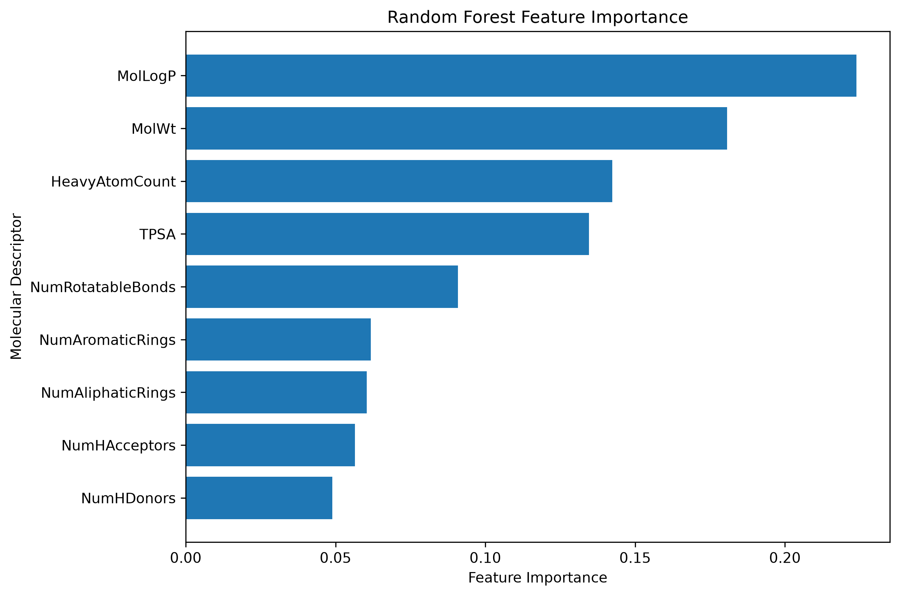

# Molecular Toxicity Prediction

A machine learning project for predicting **NR-ER (Nuclear Receptor Estrogen Receptor) activity** from molecular structure.

The project uses molecular data from the **Tox21 dataset**, RDKit-based feature engineering, machine learning models, and an interactive Streamlit application.

## Live Demo

Try the deployed application here:

[Molecular Toxicity Predictor] (https://moleculartoxicityprediction.streamlit.app/)

---

## Overview

Predicting potential molecular toxicity is an important problem in drug discovery and chemical safety. Traditional experimental testing can be expensive and time-consuming, making machine learning a useful tool for prioritizing compounds for further investigation.

This project focuses on predicting activity in the **NR-ER toxicity assay** using molecular structure information.

The workflow includes:

* Exploratory data analysis
* Missing-value analysis
* Molecular descriptor generation with RDKit
* Morgan fingerprint generation
* Logistic Regression baseline modeling
* Random Forest modeling
* Hyperparameter tuning
* Model evaluation using metrics appropriate for an imbalanced dataset
* Saving the final trained model
* Deployment through a Streamlit web application

---

## Dataset

The project uses the **Tox21 dataset**, containing molecular SMILES representations and multiple toxicity-related biological assay endpoints.

The original dataset contains:

* **7,831 molecules**
* **12 toxicity assay targets**
* A molecular identifier (`mol_id`)
* Molecular structures represented as SMILES

The available toxicity targets include:

```text
NR-AR
NR-AR-LBD
NR-AhR
NR-Aromatase
NR-ER
NR-ER-LBD
NR-PPAR-gamma
SR-ARE
SR-ATAD5
SR-HSE
SR-MMP
SR-p53
```

This project focuses specifically on:

```text
NR-ER
```

---

## Exploratory Data Analysis

The dataset was examined to understand:

* Dataset structure
* Missing values
* Class distributions
* Positive and negative toxicity rates

The NR-ER target contains missing values, so rows without an NR-ER label were removed before model development.

After preprocessing, the modeling dataset contained approximately:

```text
6,186 molecules
```

The NR-ER dataset was imbalanced:

* Approximately **87% inactive**
* Approximately **13% active**

This imbalance made accuracy alone an unsuitable metric for evaluating model performance.

---

## Feature Engineering

Two approaches were explored for representing molecular structures.

### 1. RDKit Molecular Descriptors

The first approach used physicochemical and structural descriptors generated with RDKit:

* Molecular Weight
* MolLogP
* Topological Polar Surface Area (TPSA)
* Number of Hydrogen Bond Acceptors
* Number of Hydrogen Bond Donors
* Number of Rotatable Bonds
* Heavy Atom Count
* Number of Aromatic Rings
* Number of Aliphatic Rings

Example descriptive statistics:

| Feature          |   Mean |
| ---------------- | -----: |
| Molecular Weight | 261.18 |
| MolLogP          |   2.20 |
| TPSA             |  57.87 |
| H-Bond Acceptors |   3.36 |
| H-Bond Donors    |   1.20 |
| Rotatable Bonds  |   4.14 |

### 2. Morgan Fingerprints

The second approach used **Morgan molecular fingerprints**, which provide a structural representation of molecules suitable for machine learning.

The final fingerprint configuration used:

```text
Radius: 2
Fingerprint size: 2048 bits
```

Morgan fingerprints were generated using RDKit's modern `MorganGenerator` implementation.

---

## Train-Test Split

The data was split using stratified sampling to preserve the class distribution.

### Training set

```text
Inactive: 87.21%
Active:   12.79%
```

### Test set

```text
Inactive: 87.24%
Active:   12.76%
```

This ensured that both training and testing data reflected the original class imbalance.

---

## Machine Learning Models

### Logistic Regression Baseline

A Logistic Regression model was used as the baseline.

Results:

| Metric    | Score |
| --------- | ----: |
| Accuracy  | 0.868 |
| Precision | 0.000 |
| Recall    | 0.000 |
| F1 Score  | 0.000 |
| ROC-AUC   | 0.667 |

Although the model achieved relatively high accuracy, it predicted no positive cases.

This demonstrates an important issue with imbalanced classification:

> A model can achieve high accuracy simply by predicting the majority class.

For this reason, additional metrics such as precision, recall, F1 score, and ROC-AUC were used to evaluate the models.

---

## Random Forest with Molecular Descriptors

A Random Forest model using RDKit molecular descriptors was trained and evaluated.

Initial results showed:

| Metric    | Score |
| --------- | ----: |
| Accuracy  | 0.875 |
| Precision | 0.528 |
| Recall    | 0.177 |
| F1 Score  | 0.265 |
| ROC-AUC   | 0.685 |

Hyperparameter tuning was then performed.

Best parameters:

```python
{
    "max_depth": 10,
    "min_samples_leaf": 1,
    "n_estimators": 200
}
```

Best cross-validation F1 score:

```text
0.405
```

### Final Descriptor Random Forest

| Metric    | Score |
| --------- | ----: |
| Accuracy  | 0.841 |
| Precision | 0.387 |
| Recall    | 0.424 |
| F1 Score  | 0.405 |
| ROC-AUC   | 0.716 |

Confusion matrix:

```text
[[974 106]
 [ 91  67]]
```

---

## Random Forest with Morgan Fingerprints

A second Random Forest model was trained using Morgan fingerprints.

Initial results:

| Metric    | Score |
| --------- | ----: |
| Accuracy  | 0.873 |
| Precision | 0.507 |
| Recall    | 0.228 |
| F1 Score  | 0.314 |
| ROC-AUC   | 0.694 |

Hyperparameter tuning identified the following configuration:

```python
{
    "max_depth": 20,
    "min_samples_leaf": 2,
    "n_estimators": 300
}
```

Best cross-validation F1 score:

```text
0.430
```

---

# Final Model

The final model was a tuned **Random Forest classifier using Morgan fingerprints**.

### Final Test Results

| Metric    |     Score |
| --------- | --------: |
| Accuracy  |     0.855 |
| Precision |     0.426 |
| Recall    |     0.399 |
| F1 Score  | **0.412** |
| ROC-AUC   | **0.718** |

The final Morgan fingerprint model was selected because it achieved a stronger balance between identifying active compounds and controlling false positives.

While the accuracy was lower than the baseline, the model provided substantially better performance on the minority active class.

This highlights why **accuracy should not be used alone when evaluating imbalanced datasets**.

---

## Model Comparison

| Model                               |  Accuracy | Precision | Recall |        F1 |   ROC-AUC |
| ----------------------------------- | --------: | --------: | -----: | --------: | --------: |
| Logistic Regression                 |     0.868 |     0.000 |  0.000 |     0.000 |     0.667 |
| Random Forest — Descriptors         |     0.841 |     0.387 |  0.424 |     0.405 |     0.716 |
| Random Forest — Morgan Fingerprints | **0.855** | **0.426** |  0.399 | **0.412** | **0.718** |

---

## Feature Importance

The descriptor-based Random Forest model was also used to investigate which molecular properties contributed most to predictions.



This analysis provides interpretability for the descriptor-based approach, although the final deployed model uses Morgan fingerprints.

---

## ROC Curve

The models were evaluated using ROC-AUC to measure their ability to distinguish between active and inactive molecules across classification thresholds.


---

# Streamlit Application

The project includes an interactive Streamlit application that allows users to enter a molecular SMILES representation and receive a prediction.

[Open the live Molecular Toxicity Predictor] (https://moleculartoxicityprediction.streamlit.app/)

The application:

* Accepts molecular SMILES input
* Validates the molecular structure using RDKit
* Generates a Morgan fingerprint
* Uses the trained Random Forest model
* Predicts NR-ER activity
* Displays the predicted probability of activity
* Shows molecular properties including:

  * Molecular Weight
  * LogP
  * Topological Polar Surface Area (TPSA)
* Handles invalid SMILES input without crashing

The prediction pipeline is:

```text
SMILES
   ↓
RDKit Molecular Parsing
   ↓
Morgan Fingerprint
   ↓
Random Forest Model
   ↓
NR-ER Activity Probability
   ↓
Active / Inactive Prediction
```

---

## Project Structure

```text
MolecularToxicityPrediction/
│
├── app.py
├── readme.md
├── requirements.txt
├── .gitignore
│
├── data/
│   ├── raw/
│   │   └── tox21.csv
│   │
│   └── processed/
│       ├── modelcomparison.csv
│       ├── nr-erdescriptors.csv
│       └── nr-ertoxicity.csv
│
├── figures/
│   ├── FeatureImportance.png
│   └── ROC Curve.png
│
├── models/
│   ├── model_config.json
│   ├── nr-er morganrandomforest.joblib
│   └── nr-er randomforest.joblib
│
└── notebook/
    └── 01 data exploration.ipynb
```

---

## Installation

Clone the repository:

```bash
git clone https://github.com/FeuFoller/MolecularToxicityPrediction.git
cd MolecularToxicityPrediction
```

Create and activate a virtual environment:

```bash
python -m venv .venv
```

Windows PowerShell:

```powershell
.venv\Scripts\Activate
```

Install the dependencies:

```bash
pip install -r requirements.txt
```

Run the application:

```bash
streamlit run app.py
```

---

## Usage

Enter a valid SMILES string into the application.

For example:

```text
CCO
```

Then click:

```text
Predict NR-ER Activity
```

The application will generate a Morgan fingerprint and return:

* Predicted classification
* Probability of NR-ER activity
* Molecular Weight
* LogP
* TPSA

---

## Technologies

This project uses:

* Python
* Pandas
* NumPy
* RDKit
* Scikit-learn
* Matplotlib
* Joblib
* Streamlit
* Git
* GitHub

---

## Limitations

This project has several limitations:

* The dataset is significantly imbalanced.
* The model predicts activity for a single endpoint: **NR-ER**.
* Predictions are based only on the molecular information available in the dataset.
* The model should not be interpreted as a complete toxicity assessment.
* Machine learning predictions should not replace experimental validation.
* Performance may vary for molecules that differ substantially from those seen during training.

---

## Future Improvements

Possible next steps include:

* Exploring additional toxicity endpoints
* Building multi-label toxicity prediction models
* Testing gradient boosting methods
* Using class weighting or advanced imbalance-handling techniques
* Performing more extensive hyperparameter optimization
* Adding applicability-domain analysis
* Adding molecular structure visualizations to the application
* Comparing Morgan fingerprints with additional molecular representations
* Deploying a model capable of predicting multiple Tox21 assay endpoints

---

## Disclaimer

This application predicts the likelihood of activity in the **NR-ER assay** based on a machine learning model.

It is intended for educational and research purposes only and should **not** be used as a clinical, diagnostic, regulatory, or definitive toxicity assessment. Experimental validation and professional scientific judgment remain necessary.

---

